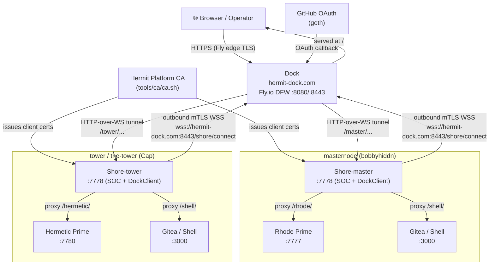
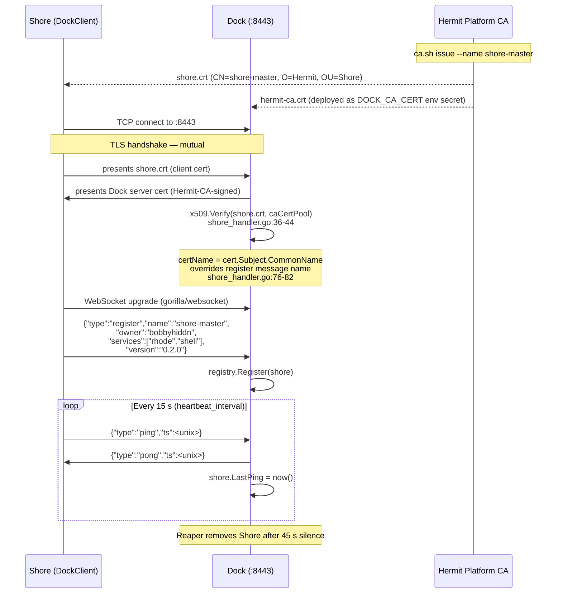
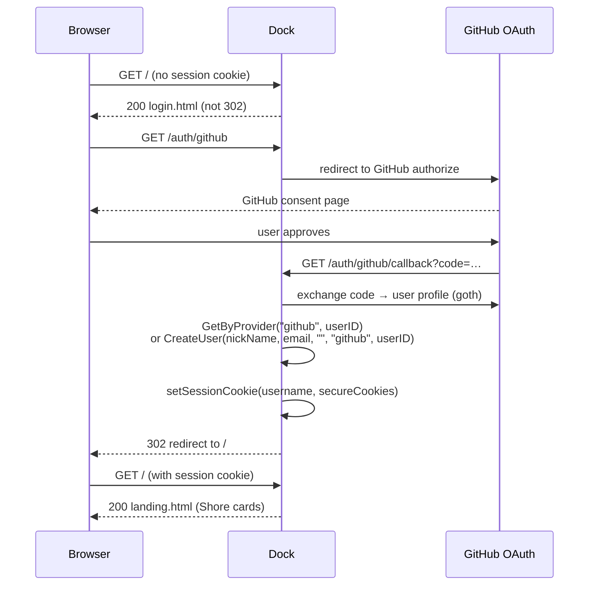
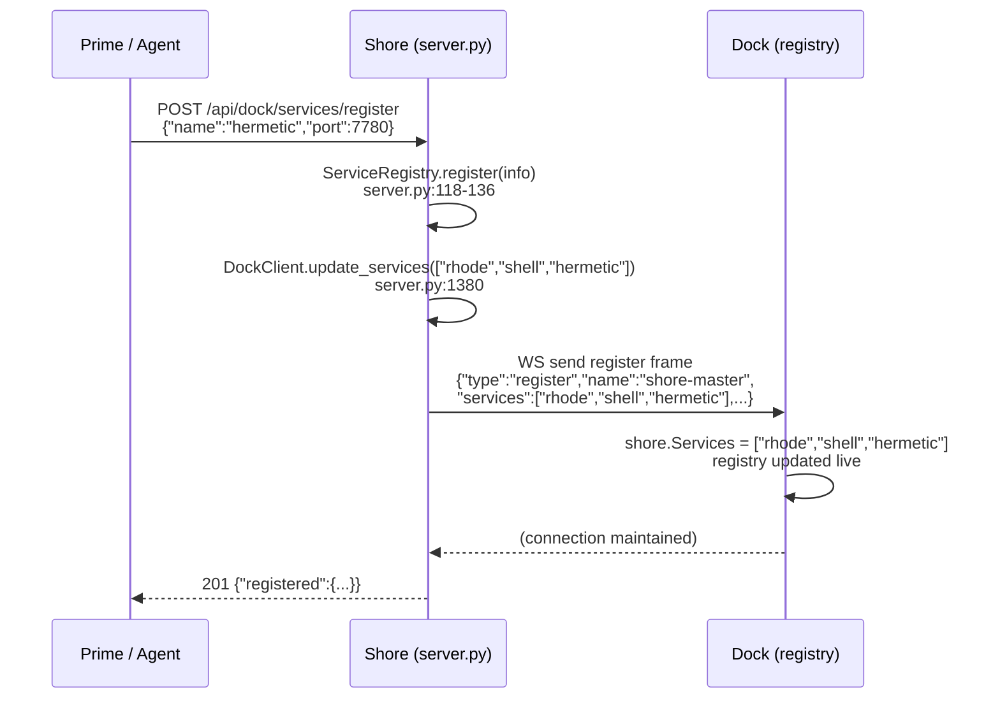
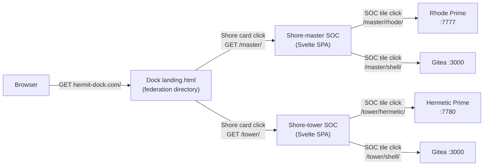

# Hermit Federation Architecture

> **Status:** Authoritative — ground truth extracted from Dock (Go) and Shore (Python) source code.
> **Last updated:** 2026-06-03 by Rhode-Pi (task #43898).
> **Related doc:** `docs/architecture.md` — Dock v2 protocol design spec (lower-level).
> **Related model:** `docs/hermit-federation.ologic` — formal Ordinal diagramming model of this doc.
> **Concurrent work:** Task #43897 (shore-first routing) implements the TARGET navigation model
> described in §4. Document the target, not just current behaviour.

---

## 1. Layered Architecture Overview

The Hermit platform is a three-tier federation. Each tier has a distinct role:

| Tier | Component | Role |
|------|-----------|------|
| **L1 — Federation Directory** | **Dock** (`hermit-dock.com`, Fly.io DFW) | Identity & auth gateway; federation directory; routes authenticated browser requests to the correct Shore over mTLS WebSocket tunnels. |
| **L2 — Host Control Plane / SOC** | **Shore** (per host, Python+Svelte) | Service Orchestration Centre for one host. Exposes the Shore SOC dashboard (Svelte SPA). Owns the registry of Primes on that host. Proxies prime dashboards under `/<service>/`. |
| **L3 — Agent Prime** | **Prime** (per agent, e.g. Rhode `:7777`, Hermetic `:7780`) | A single agent runtime with its own dashboard. One Shore can host many Primes. |



---

## 2. Dock — Federation Directory (L1)

**Repo:** `/home/bobbyhiddn/Code/Dock/` (Go, deployed on Fly.io)
**App name:** `hermit-dock` (`fly.toml:1`)
**Region:** `dfw` (`fly.toml:2`)

### 2.1 Listeners

Dock runs **two independent listeners** with different TLS postures
(`main.go:596-621`):

| Port | TLS | Purpose |
|------|-----|---------|
| `:8080` (`PORT` env) | **None** (Fly edge terminates TLS with a publicly-trusted cert) | Browser + OAuth traffic. Secure cookies set automatically because `DOCK_HOST` is non-localhost. |
| `:8443` (`MTLS_PORT` env) | **Dock-terminated TLS + mTLS** (raw TCP passthrough — Fly does NOT touch TLS on this port, `fly.toml:34-36`). App presents a Hermit-CA-signed server cert; requests and verifies Shore client cert. | Shore WebSocket connections only. |

> **Common misconception:** Cloudflare is NOT in the authentication path. CF (if used) is a
> pure transport/CDN layer. All identity checks are Dock-native: mTLS for Shores, HMAC
> session cookies + GitHub OAuth for users.

### 2.2 HTTP Mux (`main.go:374-583`)

| Route | Auth | Handler |
|-------|------|---------|
| `/healthz` | none | JSON `{status:"ok", shores:<n>}` |
| `/static/*` | none | Embedded static files |
| `/shore/connect` | mTLS only | Shore WebSocket upgrade (`shore_handler.go`) |
| `POST /login` | none | Username+password → HMAC session cookie |
| `POST /register` | none | Create local account (first user → admin) |
| `/logout` | none | Clear session cookie |
| `/auth/{provider}` | none | Goth OAuth begin/callback |
| `/status` | session | Shore registry (user-scoped) |
| `/api/shores` | session | Same as `/status`, used by landing page |
| `/*` | session | `routeToShore` (everything else) |

Root `/` serves `static/landing.html` (the post-login federation directory).

### 2.3 Shore Registry (`registry.go`)

In-memory map `name → *ShoreConnection`. Key operations:

- `Register(shore)` — replaces existing connection with same name cleanly
  (`registry.go:157-167`).
- `GetByOwner(owner, name)` — returns Shore only if it matches the
  authenticated user's owner field (`registry.go:226-235`).
- **Stale-connection reaper** — runs every 15 s, removes Shores whose
  `LastPing` is older than `staleThreshold = 45 * time.Second`
  (`registry.go:12, 238-258`).

### 2.4 Request Routing (`gateway.go`)

`resolveShore` (`gateway.go:164-188`) maps URL path → Shore:

1. Strip leading `/`, split on `/` → try `"shore-" + parts[0]` as Shore name.
   - `/master/…` → `shore-master` owned by authenticated user
   - `/tower/…` → `shore-tower` owned by authenticated user
2. Fall back to the lexicographically first Shore owned by the user if no
   prefix matches.

`routeToShore` (`gateway.go:20-98`) then:
1. Strips the shore-name prefix from the forwarded path.
2. Wraps the HTTP request as `HTTPRequestMessage` (body base64-encoded).
3. Sends over the Shore's WebSocket via `shore.SendHTTPRequest`.
4. Waits up to `requestTimeout = 30 * time.Second` for the response.
5. Writes the decoded response back to the browser.

SSE streams use `stream_start / stream_frame / stream_end` messages
(`gateway.go:102-153`).

### 2.5 User Auth (`users.go`, `main.go`)

- SQLite users table: `id, username, email, password_hash, provider, provider_id, is_admin`
  (`users.go:44-57`).
- **GitHub OAuth** via `markbates/goth` (`main.go:3, 352-556`). Callback:
  `https://hermit-dock.com/auth/github/callback`. Client ID `Ov23lik5jCeUVPSFl1dH`
  (from `GOTH_GITHUB_KEY` env). `GetByProvider` looks up existing accounts;
  `CreateUser` creates new ones (`users.go:68-78, 88-94`).
- Session: HMAC-SHA256 cookie (`hermit_session`), 7-day TTL (`main.go:347-351`).
  `createSessionToken` encodes `username:timestamp.HMAC` (`main.go:149-154`).
- First registered user or `DOCK_ADMIN_USER` gets admin (`main.go:458-462`).

---

## 3. The Three Registration Flows

These three registrations are distinct and often confused. They operate at
different layers and serve different purposes.

### 3.1 Shore → Dock Registration (the mTLS tunnel)

**Who:** Shore's `DockClient` (`dock_client.py:234-247`).
**When:** On startup; auto-reconnects with exponential backoff (5 → 10 → 20 → 40 → 60 s max).
**Direction:** Shore dials **outbound** to Dock — no inbound ports needed on the host.

**Sequence:**



**Wire frames** (from `protocol.go` and `dock_client.py`):

```json
// Registration (Shore → Dock, once per connect)
{"type":"register","name":"shore-master","owner":"bobbyhiddn",
 "services":["rhode","shell"],"version":"0.2.0"}

// Heartbeat (Shore → Dock, every 15 s)
{"type":"ping","ts":1748995200}

// Heartbeat ack (Dock → Shore)
{"type":"pong","ts":1748995200}
```

**Identity authority:** The mTLS certificate CN (`shore_handler.go:77`) takes precedence
over the `name` field in the register frame. Dock logs a warning if they differ and uses
the cert CN. The cert is issued by `tools/ca/ca.sh issue --name shore-master` and is
the authoritative identity for routing.

### 3.2 Human User Registration (GitHub OAuth)

**Who:** Browser visiting `hermit-dock.com`.
**When:** First visit (or after session expiry).
**Direction:** Browser → Dock → GitHub → Dock → browser.

**Flow:**



`main.go:509-549` shows the `GetByProvider` / `CreateUser` logic. Goth's provider is
injected via `gothic.ProviderParamKey` (`main.go:499`) since stdlib mux doesn't set
route variables.

### 3.3 Prime/Service → Shore Registration (dynamic service registry)

**Who:** A Prime agent (or provisioning script) calling Shore's HTTP API.
**When:** On Prime startup or when new services come online.
**Direction:** Prime → Shore (local HTTP), then Shore → Dock (re-sends register frame over existing WS tunnel).

**Sequence:**



`server.py:1357-1384` is `_api_dock_services_register`. `dock_client.py:193-206` is
`update_services` — it re-sends the full register frame with the new service list so
Dock's routing table reflects the change immediately without a reconnect.

This is the **seam for multi-prime-per-shore**: each Prime registers itself to its Shore;
the Shore's `PrimeRegistry` (`primes.py`) also scans `/etc/hermetic/primes.d/` (or
`~/.hermetic/primes.d/` for dev) for JSON registration files. The SOC's `PrimeRegistry`
tile renders a dynamic, health-aware grid — one tile per registered Prime — rather than
hardcoded tiles.

---

## 4. Navigation and Routing Model (Target State)

> Target state is being implemented in task #43897 (shore-first routing).

### 4.1 Request Flow (full chain)



### 4.2 URL Namespace

| URL | Handled by | Notes |
|-----|-----------|-------|
| `hermit-dock.com/` | Dock — `static/landing.html` | Federation directory (Shore cards) |
| `hermit-dock.com/master/` | Shore-master SOC | Shore strips `master` prefix, serves `/` on Shore |
| `hermit-dock.com/master/rhode/` | Rhode Prime via Shore-master proxy | Shore strips `/rhode/` prefix, proxies to `:7777` |
| `hermit-dock.com/master/shell/` | Gitea via Shore-master proxy | Shore strips `/shell/`, proxies to `:3000` |
| `hermit-dock.com/tower/` | Shore-tower SOC | Same pattern; `resolveShore` maps to `shore-tower` |
| `hermit-dock.com/tower/hermetic/` | Hermetic Prime via Shore-tower proxy | Strips `/hermetic/`, proxies to `:7780` |
| `hermit-dock.com/tower/shell/` | Gitea via Shore-tower proxy | |

`resolveShore` (`gateway.go:164-188`): strips `shore-` prefix candidate:
```go
candidate := "shore-" + parts[0]   // "/master/..." → "shore-master"
```

`shoreNameShort` in `landing.html:350-353`:
```js
return name.replace(/^shore-/, '');  // "shore-master" → "master"
```

Service chips in the landing page currently link to `/{shortName}/{svc}/`
(`landing.html:378`). The Shore card itself becomes a link to `/{shortName}/`
in the target state (task #43897 step 1).

### 4.3 Shore SOC at the Bare Shore Root

**Current behaviour:** A bare `/` forwarded to Shore falls through to the first proxy in
`_proxies` (the Rhode prime) via `dock_client.py:355-357` — the SOC is never served over
the tunnel.

**Target behaviour (task #43897 step 5):** `dock_client.py._route` checks whether the
leading path segment is a known service prefix. If not (bare `/` or unknown prefix), it
routes to the Shore's OWN web server (`:7778`) so the SOC is served at
`hermit-dock.com/master/`.

### 4.4 Base-Path Correctness for Proxied Prime Dashboards

Prime dashboards (Rhode at `:7777`, Hermetic at `:7780`) are compiled Svelte SPAs.
They emit:
- `<link href="/assets/index.css">` — absolute asset paths
- `fetch('/api/tasks')` — absolute API calls

Behind the path prefix `/master/rhode/`, these absolute paths resolve to
`hermit-dock.com/assets/…` and `hermit-dock.com/api/…` — **not** under the prefix —
causing blank screens.

**Fix (task #43897 step 6):** Shore's `ReverseProxy` (`server.py:346-362` for Rhode)
injects a `<base href="/master/rhode/">` into served HTML and rewrites `src="/assets/…"`
→ `src="/master/rhode/assets/…"`. The rewrite_rules pattern already exists for Rhode
(`server.py:346-362`). The target extends this generically for all primes by deriving
the prefix from the request path the proxy sees.

Shore's own SOC uses a relative base (`./` in `vite.config.js`) so it resolves correctly
whether served at `/` (local dev) or `/master/` (via tunnel).

---

## 5. Live Topology

| Shore | Host | Owner | Services | Proxies | Cert CN |
|-------|------|-------|----------|---------|---------|
| `shore-master` | masternode | `bobbyhiddn` | `rhode`, `shell` | rhode→`:7777`, shell→`:3000` | `shore-master` |
| `shore-tower` | the-tower (Cap) | `cap` (hermitos) | `hermetic`, `shell` | rhode→`:7777`, hermetic→`:7780`, shell→`:3000` | `shore-tower` |

**Dock deployment:**
- Fly.io app `hermit-dock`, region `dfw` (`fly.toml:1-2`)
- VM: `shared-cpu-1x`, 256 MB (`fly.toml:37-39`)
- `auto_stop_machines = "off"` — stays resident to hold Shore WS tunnels
  (`fly.toml:13`)
- Health check: `GET /healthz` every 30 s (`fly.toml:19-24`)

**Certificate paths (per host):**
- `~/.hermetic/certs/shore.crt` — Shore client cert (CN = shore name)
- `~/.hermetic/certs/shore.key` — Shore private key
- `~/.hermetic/certs/hermit-ca.crt` — Hermit Platform CA (for Shore to verify Dock's server cert)
- Dock's server cert and CA are set via env secrets `DOCK_TLS_CERT`, `DOCK_TLS_KEY`,
  `DOCK_CA_CERT`.

**Cert issuance** (`Dock/tools/ca/ca.sh`):
```bash
# Initialise CA (one-time, in tools/ca/.ca/)
./tools/ca/ca.sh init

# Issue client cert for a Shore — CN = shore name
./tools/ca/ca.sh issue --name shore-master
./tools/ca/ca.sh issue --name shore-tower --out /etc/hermetic/certs/shore-tower/
```

**Shore config** (`Shore/config/shore.toml`):
```toml
[dock]
enabled = true
url = "wss://hermit-dock.fly.dev:8443/shore/connect"   # :8443 = mTLS raw TCP
name = "shore-master"
owner = "bobbyhiddn"
cert = "/home/bobbyhiddn/.hermetic/certs/shore.crt"
key  = "/home/bobbyhiddn/.hermetic/certs/shore.key"
ca   = "/home/bobbyhiddn/.hermetic/certs/hermit-ca.crt"
services = ["rhode", "shell"]
heartbeat_interval = 15
reconnect_max = 60
```

---

## 6. WebSocket Protocol Reference

All messages are JSON text frames. Defined in `protocol.go` (Dock) and
`dock_client.py` (Shore).

| Type | Direction | Purpose |
|------|-----------|---------|
| `register` | Shore → Dock | First message after WS upgrade; announces name, owner, services |
| `ping` | Shore → Dock | Heartbeat (every 15 s); updates `shore.LastPing` |
| `pong` | Dock → Shore | Heartbeat acknowledgement |
| `http_request` | Dock → Shore | Forwarded browser HTTP request (body base64) |
| `http_response` | Shore → Dock | Proxied response (body base64) |
| `stream_start` | Dock → Shore | Opens SSE / chunked-transfer stream |
| `stream_frame` | Shore → Dock | One SSE data chunk |
| `stream_end` | Shore → Dock | Stream closed signal |

**Request correlation:** Every `http_request` carries an `id` (random hex, `main.go:67-72`).
`SendHTTPRequest` stores `id → chan` in `shore.pending`; `DeliverResponse` matches and
delivers. Timeout: 30 s (`gateway.go:13`).

**SSE streams:** `OpenStream` stores `id → chan *StreamFrameMessage` in `shore.streams`
(buffered 32, `registry.go:84-97`). Frames are forwarded live; `stream_end` closes the
channel and the browser's SSE connection.

**Body encoding:** request + response bodies are base64-encoded to safely carry binary
payloads (images, files) over the JSON text channel (`gateway.go:59-65`,
`dock_client.py:391`).

---

## 7. Security Model

| Concern | Mechanism | Source |
|---------|-----------|--------|
| Shore identity | mTLS client cert; CN is authoritative (overrides register name) | `shore_handler.go:76-82` |
| Cert issuance | Private CA (`tools/ca/ca.sh`); RSA keys, 1-year validity | `tools/ca/ca.sh` |
| Dock server identity | Hermit-CA-signed server cert on `:8443`; Shore verifies against `hermit-ca.crt` | `dock_client.py:211-214` |
| User identity | GitHub OAuth (markbates/goth) + HMAC-SHA256 session cookie (7-day) | `main.go:352-556`, `users.go` |
| User–Shore isolation | `GetByOwner(owner, name)` — users can only reach their own Shores | `registry.go:226-235` |
| No inbound ports on hosts | Shore dials outbound only; no firewall changes needed | `dock_client.py:216-232` |
| CF misconception | Cloudflare (if present) is pure TCP tunnel/CDN; no auth role | `fly.toml:33-36` |
| Audit logging | Every request: method, path, user, Shore, status, duration | `main.go:120-135` |
| Session fixation | Cookie is regenerated on every new OAuth login | `main.go:549` |

---

## 8. Relationship to Existing Models

**`Hermetic/models/hermetic-architecture.ologic`** — models the internals of the
Hermetic Go binary (MCP server, Hermes/Nous/Eidolon layers, guardrail PDP). That model
is Prime-scoped: it represents what happens _inside_ a single Prime on a single host.

**`docs/hermit-federation.ologic`** (this repo, alongside this doc) — models the
_federation layer_: Dock as the network apex, host Factories (Shore + Prime machines per
host), and the mTLS tunnel / OAuth flows as cross-factory entities. The two models are
complementary and non-overlapping. A future "Hermit OS" model would sit above both.

---

## 9. Extending the Federation

**Adding a new Shore (new host):**
1. Issue a cert: `./tools/ca/ca.sh issue --name shore-<hostname>`
2. Copy `shore.crt`, `shore.key`, `hermit-ca.crt` to `~/.hermetic/certs/` on the new host.
3. Configure `Shore/config/shore.toml` with `[dock] name = "shore-<hostname>"`.
4. Start Shore — `DockClient` dials outbound and registers automatically.
5. No Dock code changes. No Fly redeploy. The registry picks it up live.

**Adding a new Prime to an existing Shore:**
1. Start the Prime service on the host.
2. POST to Shore: `POST /api/dock/services/register {"name":"myagent","port":9000}`.
3. Shore re-sends register frame to Dock with updated service list.
4. Dock now routes `/master/myagent/` to the Shore, which proxies to `:9000`.
5. The Shore SOC's `PrimeRegistry` tile grid updates automatically.

**Graceful Shore reconnect:** `DockClient` reconnects with exponential backoff
(`dock_client.py:154-184`). Dock's `Register` replaces the stale connection cleanly
(`registry.go:157-167`). The `staleThreshold = 45 s` reaper guarantees cleanup if a
Shore disappears without a clean close (`registry.go:12`).
